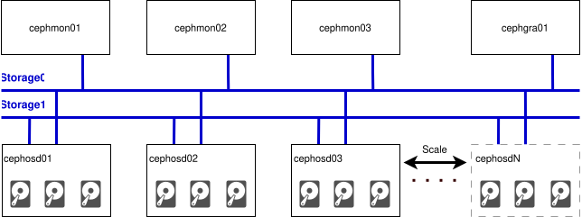

# Architecture

graph LR
    A[User] --> B[OpenStack]
    B --> C[Ceph]

---
# OpenStack Distrubutions
[Catalog](https://www.openstack.org/marketplace/distros/)

- [OSISM](https://www.openstack.org/marketplace/distros/distribution/osism/osism-distro)
- [Mirantis](https://www.openstack.org/marketplace/distros/distribution/mirantis/mirantis-openstack-for-kubernetes)
- [Canonical](https://www.openstack.org/marketplace/distros/distribution/canonical/canonical-openstack)
- [RedHat](https://docs.redhat.com/en/documentation/red_hat_openstack_services_on_openshift/18.0/html/planning_your_deployment/assembly_red-hat-openstack-services-on-openshift-overview#con_alternate-topo-rhoso_rhoso-overview)
- [FishOS](https://www.openstack.org/marketplace/distros/distribution/sardina-systems/fishos)

---
# Architecture - OpenStack

---
# Architecture - OpenStack
[//]: # (how does it look like in our simple environment?)

---
# Architecture - Ceph

---
# Architecture - Ceph
[//]: # (how does it look like in our simple environment?)

---
# Integration - OpenStack and Ceph

---
# OpenStack Deployment Approaches
- openstack-ansible
- kolla-ansible
- OpenStack on OpenShift
- OpenStack-Helm
- OSISM
- YAOOK
...

---
# Ceph Deployment Aproaches
- [cephadm (official)](https://docs.ceph.com/en/reef/cephadm/install/#cephadm-deploying-new-cluster)
- [rook](https://rook.io/)

- [ceph-ansible](https://docs.ceph.com/projects/ceph-ansible/en/latest/)
- [ceph-salt](https://github.com/ceph/ceph-salt)
- [ceph-deploy (deprecated)](https://docs.ceph.com/projects/ceph-deploy/en/latest/)
- [juju](jaas.ai/ceph-mon)
- [manually](https://docs.ceph.com/en/reef/install/index_manual/#install-manual)

---
# OpenStack Environment

---
config:
 layout: fixed
---
flowchart TB
subgraph Controllers["Controllers"]
   direction LR
       C1["controller01"]
       C2["controller02"]
       C3["controller03"]
end
subgraph NetworkNodes["NetworkNodes"]
   direction LR
       N1["network01"]
       N2["network02"]
       N3["network03"]
end
subgraph ComputeNodes["ComputeNodes"]
   direction LR
       CMP1["compute01"]
       CMP2["compute02"]
       CMP3["compute03"]
end
NetworkNodes --> Controllers
ComputeNodes --> Controllers
C1 <-.-> C2
C2 <-.-> C3
C3 <-.-> C1
N1 <-.-> N2
N2 <-.-> N3
N3 <-.-> N1

---
# Ceph Environment

    

---
# Node Groups
- Deployment node
- Infrastructure: registry, proxy, dns
- OpenStack Nodes
- Ceph Nodes

---
# Infrastructure

graph LR
    internet[Internet ]
    subgraph Infrastructure
        direction TB
        registry("Registry\n(Harbor)")
        dns("DNS\n(dnsmasq)")
        proxy("Proxy\n(squid)")
        recorder("Recorder\n(ansible/ara)")
    end
    subgraph Environment
        direction TB
        os(OpenStack)
        ceph(Ceph)
    end
    %% Connections
    registry --> internet
    proxy --> internet
    Environment --> Infrastructure
    %%registry --> os

---
# Deployment Node

architecture-beta
    group deploy(cloud)[Deployment]
      service ansible(database)[ansible]             in deploy
      service kolla-ansible(server)["kolla-ansible"] in deploy
      service cephadm(server)[cephadm]               in deploy

---
# Baremetal Node and VMs on it

graph LR
  subgraph Controllers
     direction LR
     ni01["dns"]
     ni02["registry"]
     ni03["proxy"]
     ni04["recorder"]
     ni05["deployment"]
     no01["controller01"]
     no02["controller02"]
     no03["controller03"]
     no04["controller01"]
     no05["controller02"]
     no06["controller03"]
     no07["compute01"]
     no08["compute02"]
     no09["compute03"]
     no10["monitor"]
     no11["testing"]
     nc01["cephmon01"]
     nc02["cephmon02"]
     nc03["cephmon03"]
     nc04["cephgra01"]
     nc05["cephosd01"]
     nc06["cephosd02"]
     nc07["cephosd03"]
  end

---
# Air-Gapped Environment

